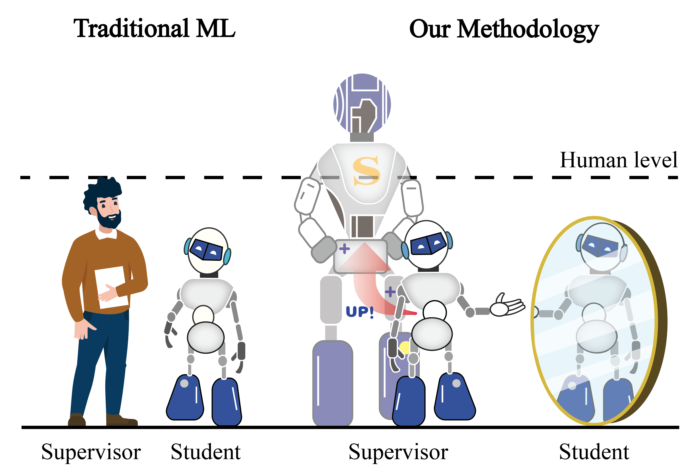
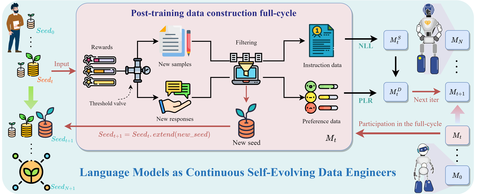
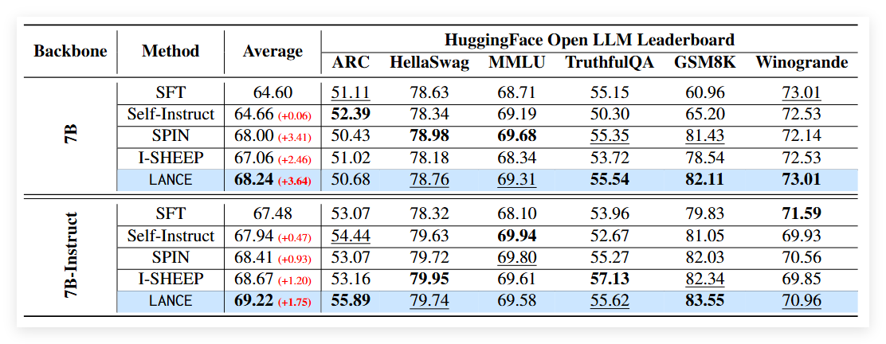
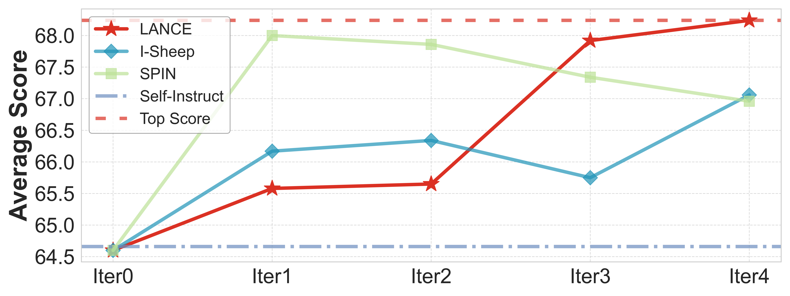
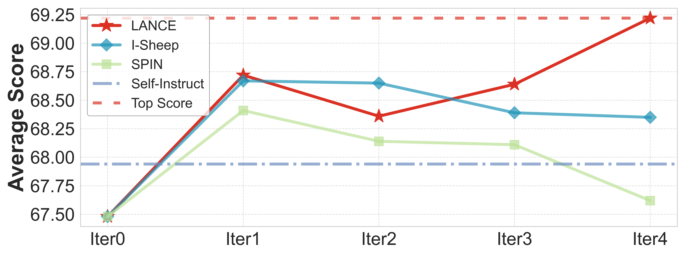
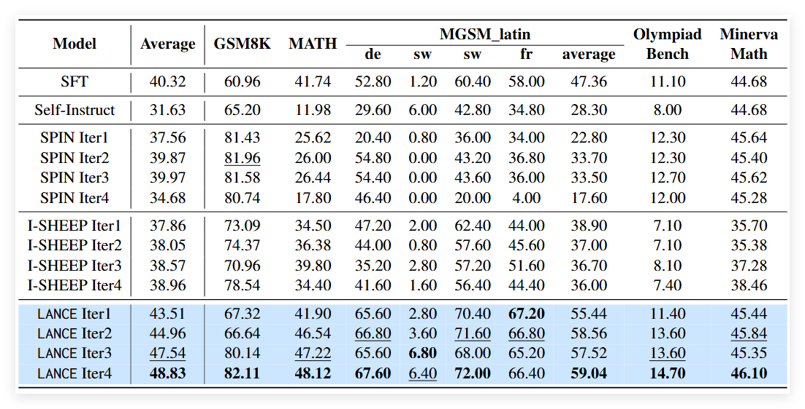

# LANCE

<p align="center">
                 <br>
    <em><strong>An illustration of our methodology.</strong> Traditional ML focuses on the setting where humans supervise models that are weaker than humans. Our methodology explores the scenario where models self-supervise, which may be a reliable path to superintelligence.</em>
</p>


<p align="center">
  <a href="LICENSE">
    
  </a>
  <a href="https://arxiv.org/abs/2412.15151">
    
  </a>
</p>


## Abstract

Large Language Models (LLMs) have demonstrated remarkable capabilities on various tasks, while the further evolvement is limited to the lack of high-quality training data. In addition, traditional training approaches rely too much on expert-labeled data, setting a ceiling on the performance of LLMs. To address this issue, we propose a novel paradigm named **LANCE** (**LAN**guage models as **C**ontinuous self-**E**volving data engineers) that enables LLMs to train themselves by autonomously generating, cleaning, reviewing, and annotating data with preference information. Our approach demonstrates that LLMs can serve as continuous self-evolving data engineers, significantly reducing the time and cost of the post-training data construction. Through iterative fine-tuning on Qwen2 series models, we validate the effectiveness of LANCE across various tasks, showing that it can maintain high-quality data generation and continuously improve model performance. Across multiple benchmark dimensions, LANCE result in an average score enhancement of **3.64** for Qwen2-7B and **1.75** for Qwen2-7B-Instruct. This training paradigm with autonomous data construction not only reduces the reliance on human experts or external models but also ensures that the data aligns with human preferences, paving the way for the development of future superintelligent systems that can exceed human capabilities.

## Overview of LANCE

<p align="center">
                 
</p>


The cycle begins at $t=0$ with pre-annotated seed dataset $Seed_{0}$. At each time step $t$, model $M_t$ generates new instruction and preference data from $Seed_{t}$ via **Post-training data construction full-cycle**. $M_t$ is fine-tuned on instruction data (NLL) to create $M_t^S$, then on preference data (PLR) to produce $M_t^D$. In the next iteration, $M_t^D$ becomes $M_{t+1}$, and new samples are merged into $Seed_{t}$ to form $Seed_{t+1}$.

## key contribution

- 🚀 We propose **LANCE** , a new approach for LLMs to autonomously generate and refine data, reducing post-training preparation costs.
- 🛠️ LANCE automates the entire data construction process, improving efficiency, quality, and model performance.
- 🧮 LANCE boosts mathematical reasoning and multilingual proficiency using only general-purpose training data.

## Results

<p align="center">
  
  <br>
  <em><strong>Performance of multiple self-evolution methods at their optimal iteration rounds across various benchmarks on Qwen2.</strong>
  SFT represents the initial model obtained through SFT on the seed dataset.
  <strong>Bold</strong> values denote the best results achieved,
  <u>underlined</u> values signify the second-best results,
  <span style="color: red;">red</span> values highlight the improvement over the base model.
  <span style="background-color: #E0F8FF; font-weight: bold;">LANCE</span> outperforms other baselines in terms of average performance across these benchmarks, often ranking as the top or second-best in most benchmarks.</em>           
</p>


<p align="center">
  
  <br>
  (a) Qwen2-7B
  <br>
  
  <br>
  (b) Qwen2-7B-Instruct
  <br>
  <em><strong>Various self-evolution methods show average scores across benchmarks.</strong>The Self-Instruct method, without iterative processes, sampled 50k examples for self-training. "Iter t" denotes the t-th iteration.</em>  
</p>


<p align="center">
  
  <em>Evolution of mathematical reasoning capabilities in multiple self-evolving algorithms on Qwen2-7B.</em>           
</p>


## Quick Start

### 1. Installation

Before proceeding, ensure that you have [Conda](https://docs.conda.io/en/latest/) installed on your system. Follow these steps to set up the environment:

```bash
# Step 1: Create a new Conda environment with Python 3.10
conda create --name LANCE python=3.10

# Step 2: Activate the environment
conda activate LANCE

# Step 3: Install required dependencies
pip install -r requirements.txt
```

This will create and activate a Conda environment named `LANCE` and install all necessary dependencies listed in `requirements.txt`.

### 2. Generate Iteration 1 Data

To generate the initial dataset for iteration 1, run the following script:

```bash
bash run_iter1.sh
```

This script will generate the data required for the first iteration of the process. The generated datasets (`sft_iter1_gathered.json` and `dpo_iter1_gathered.json`) are already formatted to comply with the input requirements of [LLaMA-Factory](https://github.com/hiyouga/LLaMA-Factory).

### 3. Train the Model Using LLaMA-Factory

We use the [LLaMA-Factory](https://github.com/hiyouga/LLaMA-Factory) framework to train our models. The generated datasets are located as follows:

- **SFT Data**: `dataset/sft/sft_iter1_gathered.json`
- **DPO Data**: `dataset/dpo/dpo_iter1_gathered.json`

Refer to the [LLaMA-Factory documentation](https://github.com/hiyouga/LLaMA-Factory) for detailed instructions on how to train the model using these datasets.

### N. Generate Iteration N Data

For subsequent iterations (e.g., iteration 2, 3, ..., N), you can generate the corresponding datasets by running the following script:

```bash
bash run_itern.sh
```

This script will generate the data required for the current iteration. The generated datasets (`sft_iterN_gathered.json` and `dpo_iterN_gathered.json`) are automatically formatted to meet the requirements of [LLaMA-Factory](https://github.com/hiyouga/LLaMA-Factory).

### N+1. Train the Model Using LLaMA-Factory

After generating the dataset for iteration N, proceed to train the model using the [LLaMA-Factory](https://github.com/hiyouga/LLaMA-Factory) framework. Use the generated datasets (`sft_iterN_gathered.json` and `dpo_iterN_gathered.json`) for training.

Refer to the [LLaMA-Factory documentation](https://github.com/hiyouga/LLaMA-Factory) for detailed instructions on model training.

## Acknowledgments

This work would not have been possible without the support of the following open-source projects:

- We used [LLaMA-Factory ](https://github.com/hiyouga/LLaMA-Factory)for model training.
- We used [OpenCompass ](https://github.com/open-compass/opencompass)and [Qwen2.5-Math ](https://github.com/QwenLM/Qwen2.5-Math)for model evaluation.

We deeply appreciate the incredible work done by the developers behind these projects!

Additionally, we extend our heartfelt thanks to **Tianhao Wu**, who generously contributed to creating Figure 1 for this paper. We also thank all other collaborators for their valuable support and contributions.